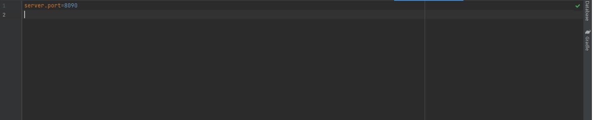
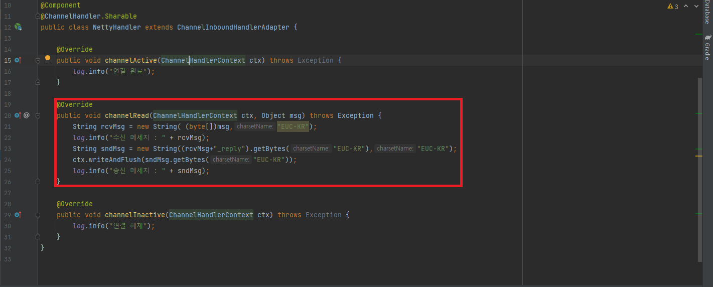
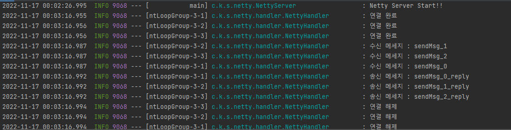

# spring_netty_server

Spring/Netty 기반 TCP 통신 서버

# 사용법

propeties 파일 안에 서버포트만 원하는 포트로 변경해주면 사용 가능하다.

수신 받은 데이터를 사용해야하는 경우, NettyHandler의 해당 부분을 수정하여 사용하면 된다.

# 결과

수신받은 3개의 메세지를 잘 처리하는 모습을 확인할 수 있다.

